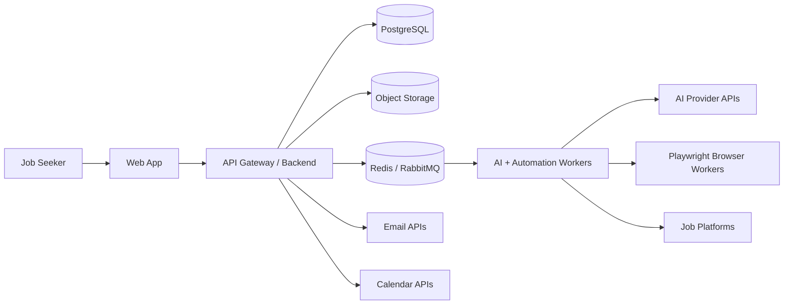
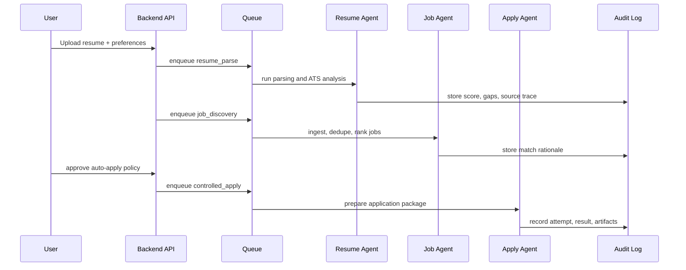
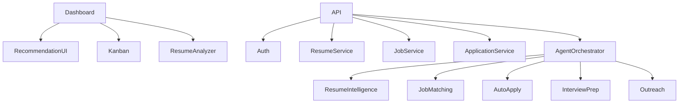
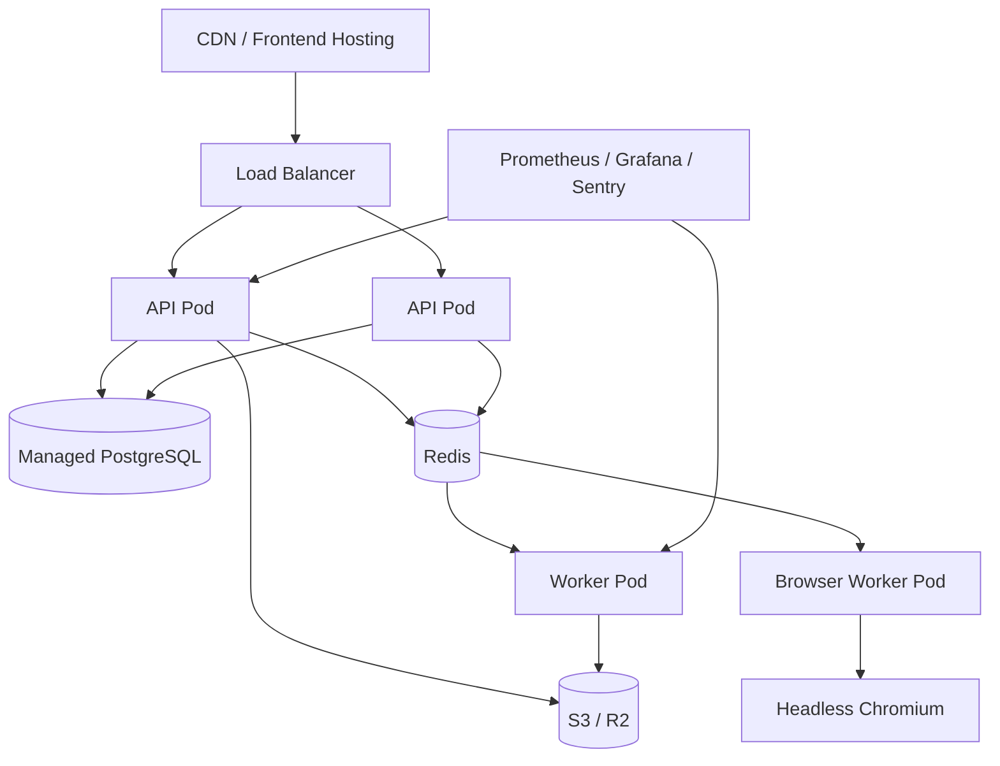

# Architecture Package

## Context

## AI Agent Flow

## Logical Components

## Deployment

## Governance Notes

- Default to approval-mode application automation until site-specific compliance is validated.
- Store every agent run with input hashes, outputs, status, cost, latency, and error details.
- Use provider abstraction for AI calls so models can be swapped without changing product workflows.
- Separate browser workers from API pods for security, cost control, and blast-radius containment.
